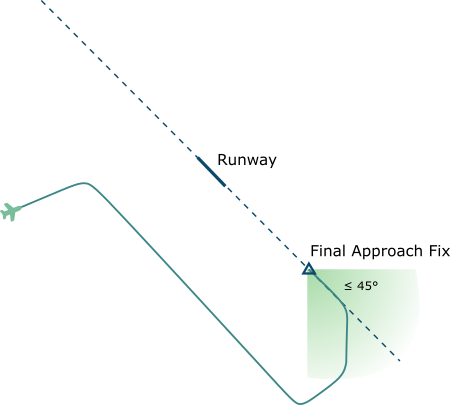
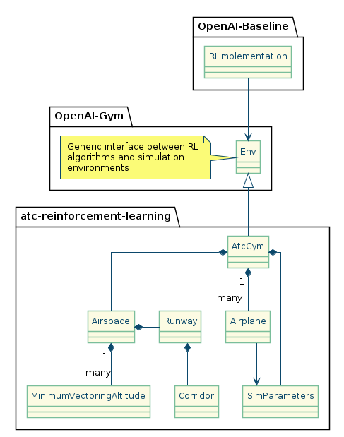

# Reinforcement Learning of Air Traffic Control Tasks
## Project Proposition
The goal is to train a neural network to perform basic Air Traffic Control Tasks through reinforcement learning. 

This approach could improve throughput of a sector, noise abatement and increase efficiency through continuous 
climb and descend profiles, which for example could save 1-2% of fuel.[2][2]

## Approach ATC Task
Air traffic control (ATC) is a service provided by ground-based air traffic controllers who direct aircraft on the 
ground and through controlled airspace, and can provide advisory services to aircraft in non-controlled airspace. [1][1]

One ATC task is approach control, which is the job of directing aircraft which are approaching an airport onto the 
final approach course at the correct altitude and within a 45 degree arc of the final approach course. 

    

Once the aircraft is established on the final approach it is handed over to the tower controller. 

## Basic Simulation Requirements
The task can be simulated in a simple fashion and later further complexities can be added to the simulation, the basic
features for a minimal viable simulation would be as follows.

### Environment
*   Simulate a minimum vectoring altitude. This is basically a coarse approximation of the terrain
*   At least one aircraft. Initially a single aircraft could be simulated
*   Runway with a final approach course
*   Final approach fix. This would be the target point to which the plane should move at or below a specific altitude
*   Basic aircraft model with fixed turn rate and descend/climb rate

### Actions
*   Assign a heading to the airplane
*   Assign an altitude to the airplane

### Reward
*   Bringing the aircraft to the Final Approach Fix (FAF) at the correct altitude and within the correct angle, wins the simulation
*   Every time step in which the airplane has not reached the FAF yet carries a small penalty
*   Descending the airplane below the Minimum Vectoring Altitude carries a heavy penalty
*   Not maintaining sufficient separation (e.g. 3nm and 1000ft) between two aircraft carries a heavy penalty
*   Having the aircraft leave the sector carries a heavy penalty

All heavy penalties could also be simulation end/game over state. 

## Ideas for the Possible Extension of the Simulation 
This problem allows for much more realism than described in the basic model above.

### Environment 
*   Multiple aircraft, all controlled by the neural network
*   Restricted and danger areas which can not be used, through which no aircraft might be vectored
*   Noise abatement areas which should be avoided, especially at low altitudes
*   Realistic aircraft model, with realistic climb rate, descend rate, turn rate
*   Variable Wind
*   Weather/Thunderstorms through which aircraft can not be vectored which are moving on the map
*   Multiple runways
*   Departing aircraft

### Actions
*   Assign a specific airspeed

### Reward
*   Realistic fuel usage and penalties for higher fuel usage
*   Aircraft performance and altitude based noise immission model with penalties for higher noise levels, especially over noise sensitive areas
*   Penalties for flight through or close to thunderstorms

A complex scenario could look like this:

    

## Implementation

The implementation consists of a simulation of the air traffic control task, with models for the airplane, 
minimum vectoring altitudes, airspace, and runway. 

A second part is implemented for applying different reinforcement learning algorithms for optimizing the 
implemented simulation. 

This approach provides a defined interface, based upon the OpenAI Gym implementation which can be plugged
into different RL algorithms for evaluating the performance of different RL algorithms on this task. 

### Structure

OpenAIs Gym Env is used as the interface between the simulation and RL algorithms. 

    

### Graphics Rendering
The 2D rendering of the current simulation state is based upon the OpenAI Gyms' rendering 
library which used pyglet as its graphics backend. 

## Original Implementation Ideas

The implementation can be split into two major parts: The simulation and the neural network. 

Simulations can for example be implemented using the OpenAI gym. This implementation could also be reused in the future
by other researchers. 

The neural network could for example be implemented based upon a Deep-Q architecture, which is readily available for
the OpenAI gym in various ML frameworks, for example PyTorch. 

### Air Traffic Simulation

Implementation of the simulator could either be done by ourselves or based upon the integration of already available
air traffic control packages.

*   ATC Simulation for ATM research: <https://github.com/ProfHoekstra/bluesky>
*   ATC Game/Simulation: <https://github.com/openscope/openscope/>

### Aircraft Performance Model

For simulating the aircraft performance multiple approaches appear viable. There is a performance model written and
maintained by Eurocontrol called BADA. This seems very comprehensive, is available under free but complicated licensing
terms, which would make collaboration more difficult. 
BADA 3 available on request at: <https://badaext.eurocontrol.fr/>

There is also a free kinematics simulation based upon ADS-B recordings: <https://github.com/junzis/wrap>
But it doesn't contain very detailed fuel usage models. Which would necessitate a more comprehensive fuel modeling. 

A physical model for the fuel usage at certain altitudes and thrust settings is available at: 
<http://www.mit.edu/~hamsa/pubs/ICRAT_2014_YSC_HB_final.pdf>

This would probably also require at least a rudimentary modeling of the engine thrust based upon the current speed and
acceleration/deceleration. For a more basic model only an approximation of the altitude dependency of the function 
will be necessary.  

The bluesky simulator already supports both BADA 3 and the open kinetics model. 

[1]: https://en.wikipedia.org/wiki/Air_traffic_control
[2]: http://www.icrat.org/icrat/seminarContent/Author/RamonCodina737/FINAL-602-cfp-Codina.pdf
